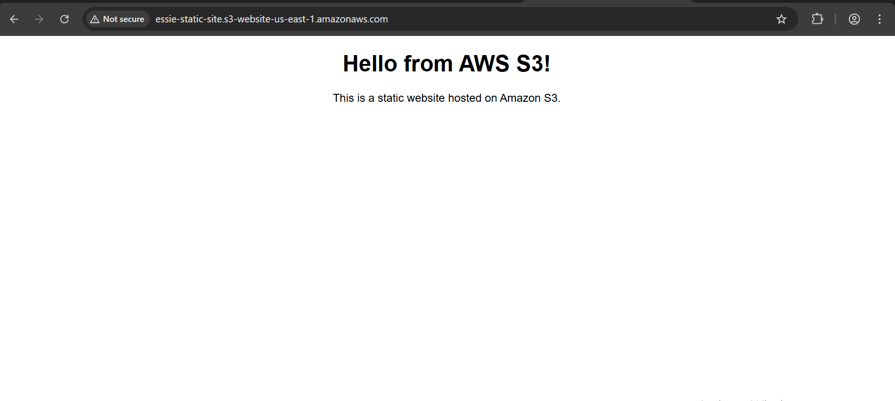
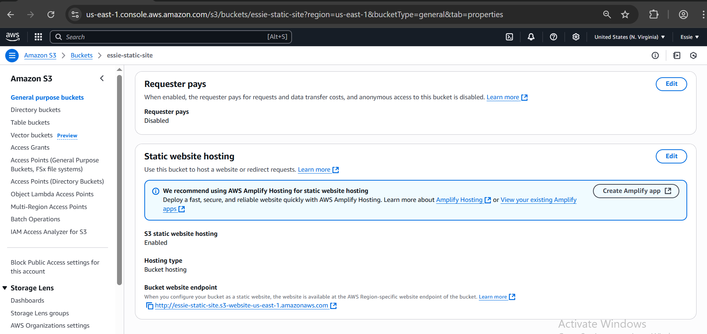

# AWS Static Website Project 🌐

This is a basic static website hosted on **Amazon S3** as part of my cloud portfolio.

## 🔗 Live Website

[Click here to view it](http://essie-static-site.s3-website-us-east-1.amazonaws.com)

## 🛠️ Technologies Used

- **Amazon S3** – to host the website
- **IAM & S3 Bucket Policy** – to allow public access
- **HTML** – for the simple homepage

## 📄 Files

- `index.html` – the main page of the website

## ✅ Status

✅ Project completed and live on AWS

## 🚀 What's Next?

- Add styling with CSS
- Add CloudFront for HTTPS and faster delivery
- Link to a custom domain (e.g. www.essieportfolio.com)
- ---

## 📸 Screenshots

### 🖥️ Live Website

### ⚙️ S3 Hosting Settings (Optional)

